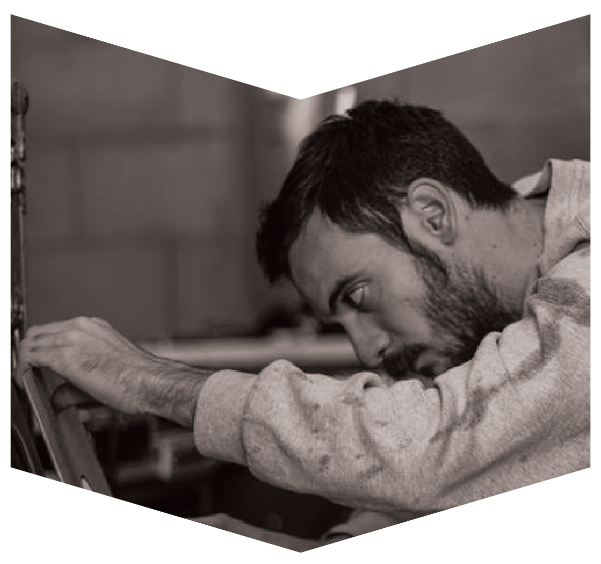

# Plasmatik

Known to steer into the deeper and frequently more cerebral side of house and techno, Janis Plasmatik has a penchant for shaping the sound. The morning slot is his favourite time to indulge in a long, drawn-out set and the last ones standing are his favourite audience.

---

<iframe width="100%" height="166" scrolling="no" frameborder="no" allow="autoplay" src="https://w.soundcloud.com/player/?url=https%3A//api.soundcloud.com/tracks/772638718&color=%231b1a65&auto_play=false&hide_related=true&show_comments=false&show_user=true&show_reposts=false&show_teaser=false"></iframe>
