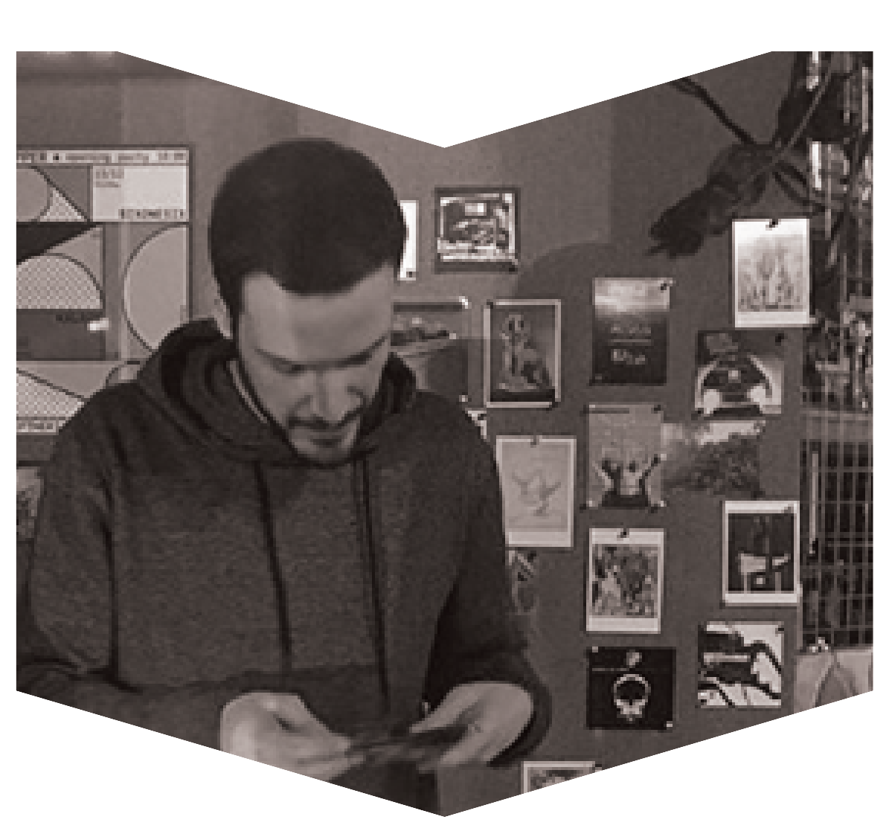

# Sixonesix

Constantinos – a.k.a Sixonesix – is a DJ born in Nicosia, Cyprus. Resident at Sousami bar in Limassol and co-founder of Panic Soup, you can also catch Sixonesix spinning tracks at various venues and parties around the island. His music is very much his own unique voice and this local artist can often be heard blending world music and distorted guitar sounds in his mostly post punk, disco and house sets. He also has an unconditional love for vinyl records and an intriguing story to tell.  

---

<iframe width="100%" height="166" scrolling="no" frameborder="no" allow="autoplay" src="https://w.soundcloud.com/player/?url=https%3A//api.soundcloud.com/tracks/658432724&color=%231b1a65&auto_play=false&hide_related=true&show_comments=false&show_user=true&show_reposts=false&show_teaser=false"></iframe>

---

<iframe width="560" height="315" src="https://www.youtube.com/embed/_P0M0cmmoiU" frameborder="0" allow="accelerometer; autoplay; encrypted-media; gyroscope; picture-in-picture" allowfullscreen></iframe>
