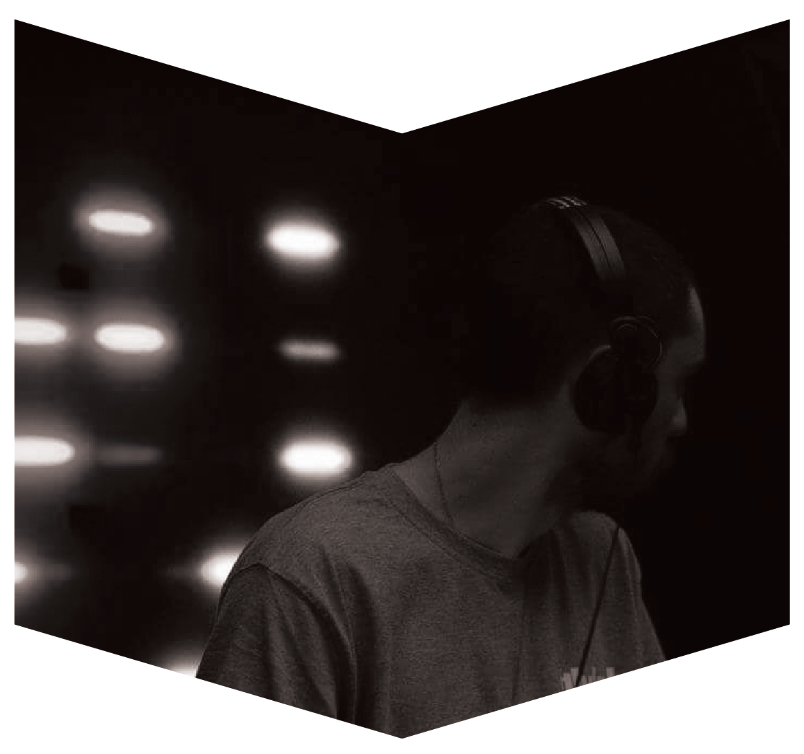

# Vsim

Synonymous with high quality electronic music, Klubd was reserved for only the very best local DJs and international talents. So as the manager, sound technician and resident of the popular nightclub, Andreas Simopoulos – or DJ Vsim – is easily amongst the island’s greats. This vinyl only maestro has a penchant for rare 90s records and spins Detroit techno, Afrofuturistic, acid and house.

---

<iframe width="100%" height="166" scrolling="no" frameborder="no" allow="autoplay" src="https://w.soundcloud.com/player/?url=https%3A//api.soundcloud.com/tracks/772300726&color=%231b1a65&auto_play=false&hide_related=true&show_comments=false&show_user=true&show_reposts=false&show_teaser=false"></iframe>
